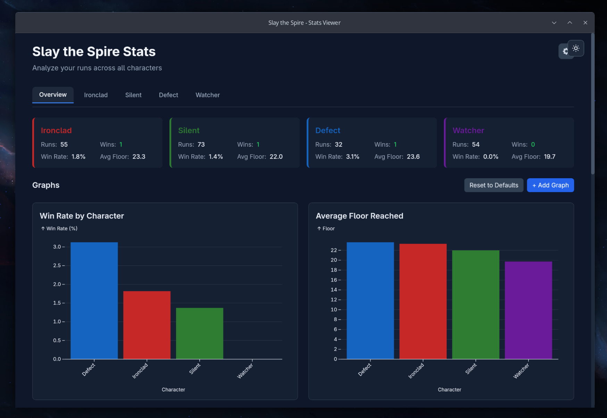
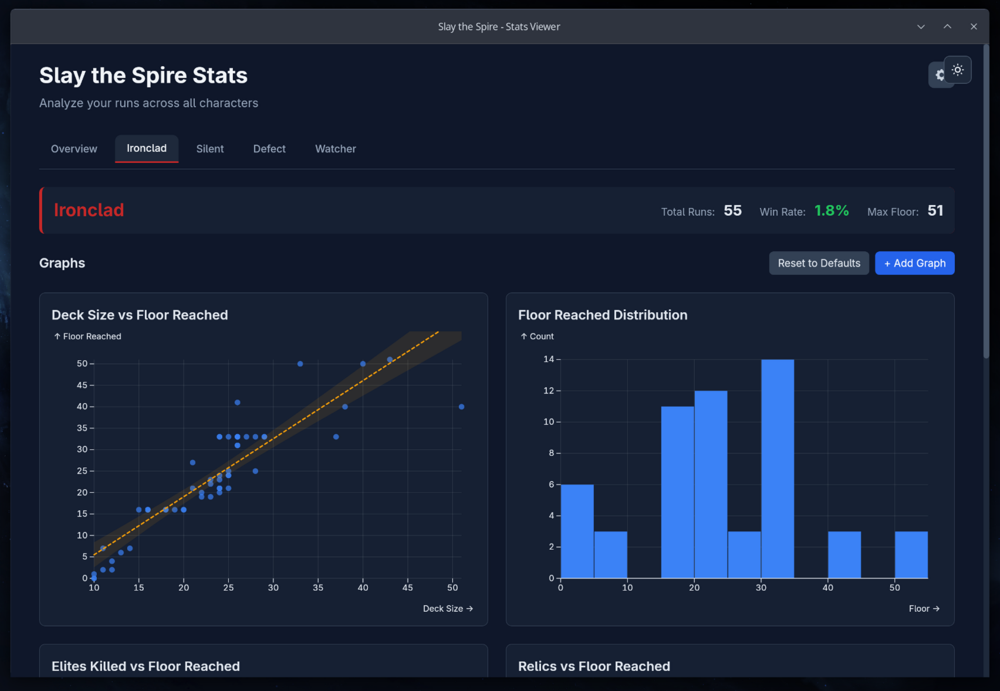

# STS Stat Viewer

A desktop application for analyzing your **Slay the Spire** run statistics.


> ⚠️ **Early Development**: This project is still in early development. Features may change, and bugs are expected. Contributions are greatly appreciated!
>
> **Found an issue?** Please report it via [GitHub Issues](../../issues) or email [kai.niermann@gmail.com](mailto:kai.niermann@gmail.com).

## Features

### Rich Visualizations
- **12 chart types**: Scatter plots, histograms, box plots, density plots, regression analysis, heatmaps, waffle charts, and more
- **Drag-and-drop** graph arrangement
- **Customizable graphs** - add, edit, and remove charts
- Built with [Observable Plot](https://observablehq.com/plot/) and D3.js

### Run Analysis
- **Character statistics**: Win rate, average floor, score distribution per character
- **Run metrics**: Deck composition, relics, damage taken, shops visited, and more
- **Filtering**: View all runs or filter by character
- **Relic & card tables** with frequency analysis

### Flexible Configuration
- **Auto-detects** Slay the Spire run data on Windows and Linux
- **Manual path override** for custom installations
- **Persists settings** across app reloads
- **Dark/light theme** support

## Screenshots

<p align="center">
  
  
</p>

## Installation

### Download Release
Download the latest release for your platform from [Releases](../../releases):
- **Linux**: `.AppImage`, `.deb`, or `.rpm`
- **Windows**: `.msi` or `.exe` installer

### Performance Note (Linux)

On Linux, the native app uses WebKitGTK which may have hardware acceleration disabled by default, causing poor rendering performance compared to browsers. To fix this:

#### Option 1: Use the GPU-enabled launch script
```bash
# Run in dev mode with hardware acceleration
pnpm tauri:dev:gpu

# Or for production builds, use the launch script:
cd src-tauri/target/release
./launch-with-gpu.sh
```

#### Option 2: Set environment variables manually
```bash
export WEBKIT_DISABLE_COMPOSITING_MODE=0
export WEBKIT_DISABLE_DMABUF_RENDERER=0
pnpm tauri dev
```

#### Option 3: Run via browser
The web version (via `pnpm dev`) always has excellent performance since browsers have GPU acceleration enabled by default.

### Build from Source

#### Prerequisites
- Node.js 20+
- Rust 1.75+
- pnpm

#### Steps
```bash
# Clone repository
git clone https://github.com/your-username/sts-stat-viewer.git
cd sts-stat-viewer

# Install dependencies
pnpm install

# Run in development mode
pnpm tauri dev

# Build for production
pnpm tauri build
```

## Project Structure

```
sts-stat-viewer/
├── .github/workflows/      # CI/CD
│   ├── test.yml           # Testing (Linux + Windows)
│   └── release.yml        # Build & release
├── openapi/               # API specification
│   └── api.yaml           # OpenAPI 3.1 spec
├── src/                   # Frontend (Svelte 5)
│   ├── lib/
│   │   ├── api/          # Type-safe API client
│   │   ├── components/   # UI components (modals, cards)
│   │   ├── plots/        # Visualization components
│   │   └── stores/       # Svelte stores (graphs, settings, theme)
│   └── routes/           # SvelteKit routes
├── src-tauri/            # Backend (Rust)
│   └── src/
│       ├── api/          # REST API (axum)
│       ├── sts/          # STS data parsing
│       └── lib.rs        # Tauri commands
└── tests/                # E2E tests (Playwright)
```

## Development

### Commands

| Command | Description |
|---------|-------------|
| `pnpm dev` | Start Vite dev server |
| `pnpm tauri dev` | Start Tauri app in dev mode |
| `pnpm build` | Build frontend |
| `pnpm tauri build` | Build production app |
| `pnpm test` | Run unit tests (Vitest) |
| `pnpm test:e2e` | Run E2E tests (Playwright) |
| `pnpm check` | TypeScript type checking |
| `pnpm generate:api` | Regenerate API types from OpenAPI |

### API Endpoints

The app runs a local REST API at `http://localhost:3030`:

| Endpoint | Description |
|----------|-------------|
| `GET /api/health` | Health check |
| `GET /api/runs` | Get all runs (with filtering) |
| `GET /api/runs/{character}` | Get character runs |
| `GET /api/stats` | Character statistics |
| `GET /api/export` | Export all data |
| `GET /swagger-ui/` | Interactive API docs |

### Visualization Components

| Component | Description |
|-----------|-------------|
| `ScatterPlot` | X-Y scatter with optional coloring |
| `Histogram` | Distribution with configurable bins |
| `BoxPlot` | Statistical box-and-whisker plots |
| `BarChart` | Categorical bar charts |
| `LineChart` | Trend lines |
| `DensityPlot` | 2D density heatmaps |
| `RegressionPlot` | Linear regression with confidence |
| `Heatmap` | Field correlation matrix |
| `WaffleChart` | Proportional area charts |
| `DotPlot` | Cleveland dot plots |
| `StackedArea` | Stacked area over categories |
| `ItemTable` | Sortable relic/card tables |

## Tech Stack

### Frontend
- **Svelte 5** with runes
- **SvelteKit** with static adapter
- **TypeScript** (strict mode)
- **Tailwind CSS** for styling
- **Observable Plot** + D3 for visualizations
- **Effect-TS** for functional error handling
- **svelte-dnd-action** for drag-and-drop

### Backend
- **Rust** with Tauri 2.0
- **Axum** web framework
- **utoipa** for OpenAPI generation
- **Swagger UI** for API documentation
- **serde** for JSON serialization

### Testing
- **Vitest** for unit tests
- **Playwright** for E2E tests
- **GitHub Actions** for CI/CD

## Configuration

### Custom Run Data Path

If the app can't auto-detect your Slay the Spire installation:

1. Click the ⚙️ settings icon in the header
2. Enter the path to your `runs` folder
3. Click **Save**

The path is persisted in localStorage and restored on app restart.

### Auto-detected Paths

| Platform | Path |
|----------|------|
| Linux (Steam) | `~/.local/share/Steam/steamapps/common/SlayTheSpire/runs` |
| Windows | `%LOCALAPPDATA%/Steam/steamapps/common/SlayTheSpire/runs` |
| Windows (alt) | `C:/Program Files (x86)/Steam/steamapps/common/SlayTheSpire/runs` |

## Contributing

1. Fork the repository
2. Create a feature branch
3. Make your changes
4. Run tests: `pnpm test && cd src-tauri && cargo test`
5. Submit a pull request

## License

MIT

## Acknowledgments

- [Slay the Spire](https://www.megacrit.com/) by Mega Crit
- [Tauri](https://tauri.app/) for the app framework
- [Observable Plot](https://observablehq.com/plot/) for visualizations
